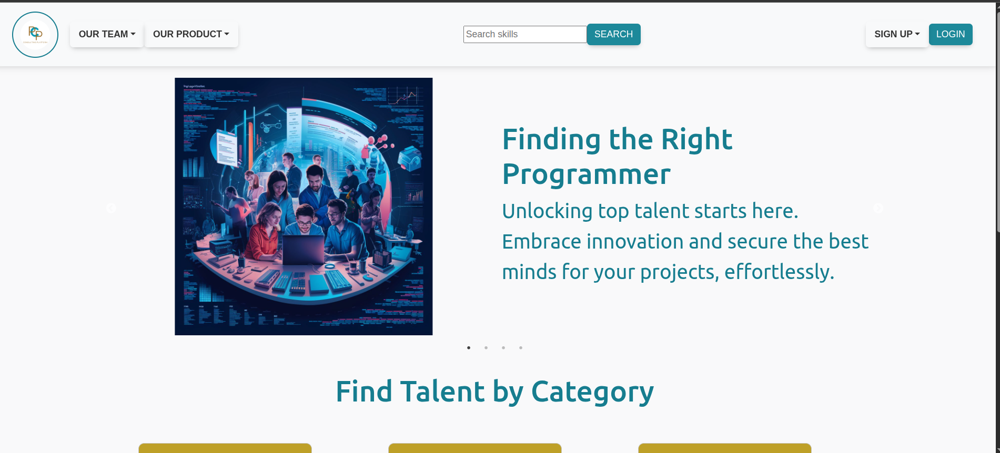
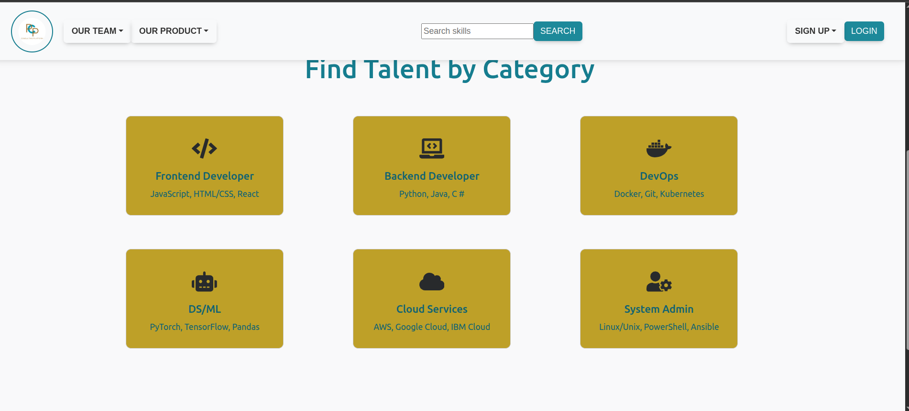
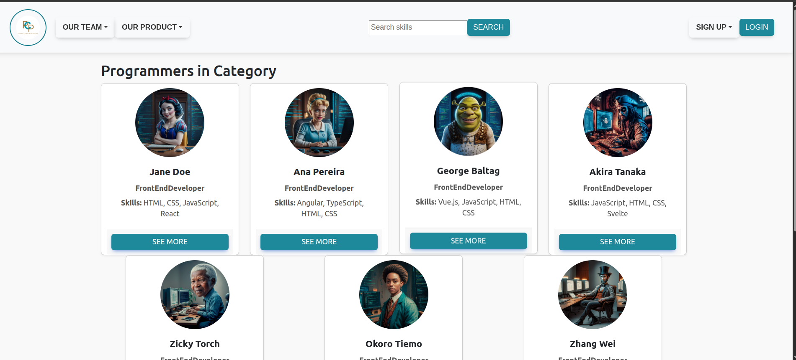
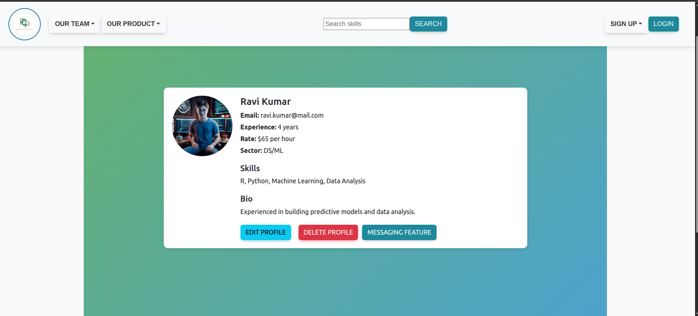
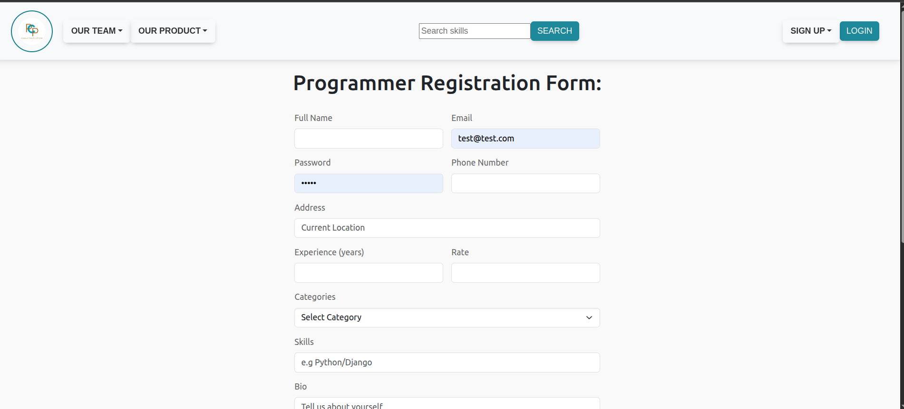
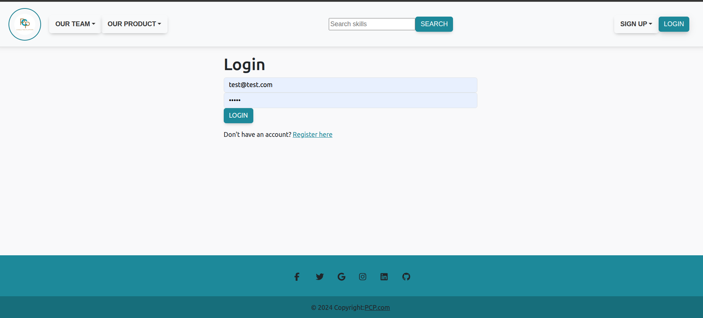
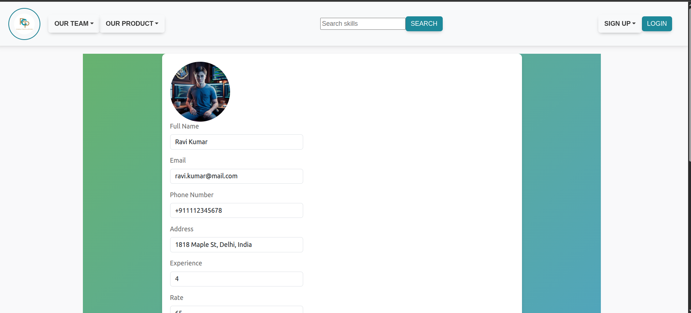

# PCP - Programmer Connection Platform

A full-stack web application that connects clients with professional programmers across multiple specializations. Built with **React** and **Django**, this platform enables users to browse programmers by category, view detailed profiles, and connect with talent that matches their project needs.



## 🌟 Live Demo

This project demonstrates a complete hiring platform with user authentication, profile management, and category-based search functionality.

---

## 📋 Table of Contents

- [Features](#-features)
- [Screenshots](#-screenshots)
- [Tech Stack](#-tech-stack)
- [Installation](#-installation)
- [Usage](#-usage)
- [Project Structure](#-project-structure)
- [API Endpoints](#-api-endpoints)
- [Future Enhancements](#-future-enhancements)
- [Contributing](#-contributing)
- [License](#-license)

---

## ✨ Features

### For Clients (Employers)
- 🔍 **Browse by Category** - Find programmers in 6 specialized categories:
  - Frontend Developer
  - Backend Developer
  - DevOps Engineer
  - Data Science/Machine Learning
  - Cloud Services
  - System Administration
- 🎯 **Skill-based Search** - Search programmers by specific technologies and skills
- 👤 **Detailed Profiles** - View programmer experience, rates, skills, bio, and CV
- 💬 **Messaging System** - Direct communication with programmers (feature in development)

### For Programmers
- 📝 **Profile Creation** - Register with comprehensive profile information
- ✏️ **Profile Management** - Edit skills, bio, rates, and upload CV
- 📁 **Category Selection** - Choose from multiple specialization categories
- 🖼️ **Photo Upload** - Add professional profile picture

### Technical Features
- 🔐 **JWT Authentication** - Secure login and registration system
- 📱 **Responsive Design** - Mobile-friendly interface
- 🎨 **Modern UI** - Clean, professional design with consistent color scheme
- 🔄 **RESTful API** - Well-structured backend API
- 🗄️ **PostgreSQL Database** - Robust data storage

---

## 📸 Screenshots

### Home Page & Categories
The landing page features a hero section and category browsing:



### Programmer Listings
Browse programmers filtered by category with quick overview cards:



### Detailed Profile View
View complete programmer profiles with all relevant information:



### User Registration
Simple registration form for new programmers:



### Login System
Secure authentication for returning users:



### Profile Editing
Programmers can update their information at any time:



---

## 🛠️ Tech Stack

### Frontend
- **React** 18.3.1 - UI library
- **React Router** 6.24.0 - Navigation and routing
- **Axios** 1.7.2 - HTTP client for API requests
- **Bootstrap** 5.3.3 - CSS framework
- **CoreUI** 5.0.2 - React UI components
- **React Icons** 5.2.1 - Icon library
- **Sass** 1.77.5 - CSS preprocessor

### Backend
- **Django** 5.0.6 - Python web framework
- **Django REST Framework** 3.15.1 - API toolkit
- **PostgreSQL** - Database (via psycopg2-binary 2.9.9)
- **JWT** (djangorestframework-simplejwt 5.3.1) - Token-based authentication
- **Pillow** 10.3.0 - Image processing
- **django-cors-headers** 4.3.1 - CORS handling

### Development Tools
- **React Scripts** 5.0.1 - Build tooling
- **Python** 3.10+
- **Node.js** & npm

---

## 🚀 Installation

### Prerequisites
- **Node.js** (v18+) and npm
- **Python** (v3.10+)
- **PostgreSQL** database

### Backend Setup

1. **Clone the repository**
   ```bash
   git clone https://github.com/PaulaMenesesSalinas/PCP.git
   cd PCP
   ```

2. **Create and activate virtual environment**
   ```bash
   python3 -m venv pcp-env
   source pcp-env/bin/activate  # On Windows: pcp-env\Scripts\activate
   ```

3. **Install Python dependencies**
   ```bash
   pip install -r requirements.txt
   ```

4. **Configure database**
   - Create a PostgreSQL database
   - Update database settings in `backend/backend/settings.py`

5. **Run migrations**
   ```bash
   cd backend
   python3 manage.py makemigrations
   python3 manage.py migrate
   ```

6. **Create superuser (optional)**
   ```bash
   python3 manage.py createsuperuser
   ```

7. **Start the backend server**
   ```bash
   python3 manage.py runserver
   ```
   The backend will run at `http://localhost:8000`

### Frontend Setup

1. **Navigate to frontend directory**
   ```bash
   cd frontend
   ```

2. **Install dependencies**
   ```bash
   npm install
   ```

3. **Start the development server**
   ```bash
   npm start
   ```
   The frontend will run at `http://localhost:3000`

---

## 💡 Usage

### As a Client
1. Visit the homepage at `http://localhost:3000`
2. Browse categories or use the search bar to find programmers
3. Click on a programmer's card to view their full profile
4. Contact programmers through the messaging feature (in development)

### As a Programmer
1. Click "SIGN UP" to create an account
2. Fill in your profile information:
   - Personal details (name, email, phone, address)
   - Professional info (category, skills, experience, rate)
   - Upload profile picture and CV
3. Log in to edit your profile anytime
4. Your profile will appear in the relevant category listings

### Admin Panel
Access the Django admin panel at `http://localhost:8000/admin` to manage:
- User accounts
- Programmer profiles
- Categories
- Messages (when implemented)

---

## 📁 Project Structure

```
PCP/
├── backend/                 # Django backend
│   ├── api/                # API app
│   ├── backend/            # Project settings
│   ├── media/              # Uploaded files (CVs, photos)
│   ├── messaging/          # Messaging feature
│   └── manage.py           # Django management script
│
├── frontend/               # React frontend
│   ├── public/            # Static assets
│   ├── src/               # Source code
│   │   ├── components/    # React components
│   │   ├── pages/         # Page components
│   │   ├── services/      # API service layer
│   │   └── App.js         # Main app component
│   └── package.json       # Frontend dependencies
│
├── screenshots/           # Application screenshots
├── pcp-env/              # Python virtual environment
├── requirements.txt      # Python dependencies
└── README.md            # This file
```

---

## 🔌 API Endpoints

### Authentication
- `POST /api/register/` - Register new programmer
- `POST /api/login/` - User login
- `POST /api/token/refresh/` - Refresh JWT token

### Programmers
- `GET /api/programmers/` - List all programmers
- `GET /api/programmers/{id}/` - Get programmer details
- `PUT /api/programmers/{id}/` - Update programmer profile
- `DELETE /api/programmers/{id}/` - Delete programmer profile

### Categories
- `GET /api/categories/` - List all categories
- `GET /api/categories/{id}/programmers/` - Get programmers by category

### Search
- `GET /api/search/?skills={query}` - Search programmers by skills

---

## 🔮 Future Enhancements

- [ ] Complete messaging system between clients and programmers
- [ ] Advanced filtering (by rate, experience, location)
- [ ] Rating and review system
- [ ] Portfolio/project showcase for programmers
- [ ] Booking and scheduling system
- [ ] Payment integration
- [ ] Email notifications
- [ ] Real-time chat
- [ ] Multi-language support
- [ ] Mobile app version

---

## 🤝 Contributing

This is a portfolio project, but suggestions and feedback are welcome! If you'd like to contribute:

1. Fork the repository
2. Create a feature branch (`git checkout -b feature/AmazingFeature`)
3. Commit your changes (`git commit -m 'Add some AmazingFeature'`)
4. Push to the branch (`git push origin feature/AmazingFeature`)
5. Open a Pull Request

---

## 👩‍💻 Author

**Paula Meneses Salinas**

- GitHub: [@PaulaMenesesSalinas](https://github.com/PaulaMenesesSalinas)
- LinkedIn: [Add your LinkedIn]
- Portfolio: [Add your portfolio website]

---

## 📄 License

This project was created as a final bootcamp project and is available for educational purposes.

---

## 🙏 Acknowledgments

- Built as the final project for [Your Bootcamp Name]
- Thanks to the bootcamp instructors and classmates for their support
- UI inspiration from modern freelancing platforms

---

## 📞 Contact

For any questions or collaboration opportunities, feel free to reach out!

**Note**: This project is continuously being improved and updated with new features.

---

*Last updated: February 2026*
